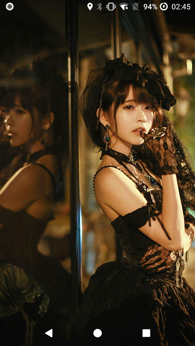
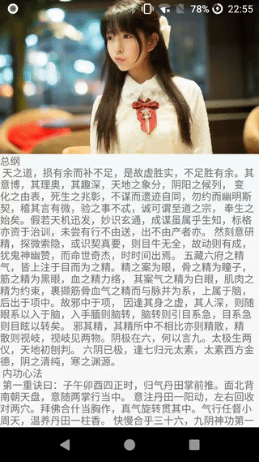
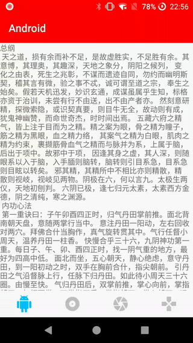

# UltimateBarX
一款方便的设置状态栏和导航栏的各种效果的框架

[](https://jitpack.io/#com.gitee.zackratos/UltimateBarX)

github 地址：[UltimateBarX](https://github.com/Zackratos/UltimateBarX)

gitee 地址：[UltimateBarX](https://gitee.com/zackratos/UltimateBarX)

详细介绍：[这就是 github 上最好用的 Android 状态栏导航栏库](https://juejin.cn/post/6903165109485436935)

> * 可以设置各种效果，透明、半透明、固定颜色、布局是否侵入等
> * 状态栏和导航栏分开设置，互不影响
> * 支持 Android 4.4 以上，各系统版本的现实效果高度统一
> * 支持低版本（不支持变灰）重新设置状态栏导航栏的背景
> * 支持 `Activity` 和 `Fragment`
> * 同一个 `Activity` 或 `Fragment` 可以多次设置不同的效果
> * 适配刘海屏、滴水屏、挖孔屏、全面屏
> * 适配 miui、emui、funtouch 等 rom
> * 适配横屏、竖屏

## 同类型框架对比
|  | [UltimateBarX](https://github.com/Zackratos/UltimateBarX) | [StatusBarCompat](https://github.com/niorgai/StatusBarCompat) | [StatusBarUtil](https://github.com/laobie/StatusBarUtil) | [ImmersionBar](https://github.com/gyf-dev/ImmersionBar) |
| ------ | :------: | :------: | :------: | :------: |
| 状态栏修改 | ✅ | ✅ | ✅ | ✅ |
| 导航栏修改 | ✅ | ❌ | ❌ | ✅ |
| 状态栏和导航栏<br/>独立设置互不影响 | ✅ | ❌ | ❌ | ❌ |
| light 模式 | ✅ | ✅ | ✅ | ✅ |
| light 模式兼容低版本 | ✅ | ❌ | ❌ | ✅ |
| 支持 Fragment | ✅ | ❌ | ❌ | ✅ |
| 布局侵入 | ✅ | ✅ | ✅ | ✅ |
| 布局不侵入 | ✅ | ✅ | ✅ | ✅ |
| 侵入和不侵入无缝切换 | ✅ | ❌ | ❌ | ❌ |
| 多次设置 | ✅ | ✅ | ✅ | ✅ |
| 适配全面屏 | ✅ | ❌ | ❌ | ✅ |
| 国产 rom 导航栏适配 | ✅ | ❌ | ❌ | ⭕️ |
| BottomNavigationView 兼容 | ✅ | ❌ | ❌ | ❌ |
| 软键盘 adjustResize 兼容 | ✅ | ❌ | ❌ | ❌ |

## 使用方法
在根目录的 build.gradle 里面添加
```groovy
allprojects {
    repositories {
        ...
        maven { url 'https://jitpack.io' }
    }
}
```
在子目录的 build.gradle 中添加
```groovy
dependencies {
    // release 版本
    // 将 $lastVersion 替换成上图中的版本号
    implementation 'com.gitee.zackratos:UltimateBarX:$lastVersion'
    
    // snapshot 版本
    implementation 'com.gitee.zackratos:UltimateBarX:dev-SNAPSHOT'
}
```

在 `Activity` 或 `Fragment` 中
```kotlin
// 设置状态栏
statusBar {
    // 布局是否侵入状态栏（true 不侵入，false 侵入）
    fitWindow = true
    // 状态栏背景颜色（色值）
    color = Color.RED
    // 状态栏背景颜色（资源 id）
    colorRes = R.color.deepSkyBlue
    // 状态栏背景 drawable
    drawableRes = R.drawable.bg_common
    // 以上三个设置背景的方法用一个即可，如多次设置，后面的会把前面的覆盖掉
    // light模式：状态栏字体 true: 灰色，false: 白色 Android 6.0+
    light = true
    // 低版本 light 模式不生效，重新设置状态栏背景
    // 防止状态栏背景色跟字体颜色一致导致字体看不见
    // lvl 系列方法仅在低版本（不支持 light 模式的版本）下开启 light 模式生效
    lvlColor = Color.BLACK
    lvlColorRes = R.color.cyan
    lvlDrawableRes = R.drawable.bg_lvl
    // 以上三个 lvl 方法用一个即可，如多次设置，后面的会把前面的覆盖掉
}

// 设置导航栏
navigationBar {
    // 布局是否侵入导航栏（true 不侵入，false 侵入）
    fitWindow = true
    // ···
    // 其他方法与 statusBar 中的方法一致
}
```

使用 `transparent` 方法可以快速设置透明效果
```kotlin
statusBar {
    transparent()
}
```

跟下面的写法效果是一样的
```kotlin
statusBar {
    fitWindow = false
    color = Color.TRANSLUCENT
}
```

使用 `getStatusBar` 方法和 `getNavigationBar` 方法可以在上一次的基础上修改  

例如，先用下面的代码实现状态栏变红色，不侵入，非 light 模式
```kotlin
statusBar {
    color = Color.RED
    fitWindow = true
    light = false
}
```

然后需要设置 light 模式，其他效果保持不变，直接用下面的方法即可
```kotlin
getStatusBar {
    light = true
}
```

当布局可侵入状态栏或导航栏时，如果需要给某个 `View` 增加状态栏或者导航栏的高度，可以
```kotlin
targetView.addStatusBarTopPadding()
targetView.addNavigationBarBottomPadding()
```

`java` 中使用
```java
UltimateBarX.statusBar(this)
        .fitWindow(true)
        .colorRes(R.color.deepSkyBlue)
        .light(true)
        .lvlColorRes(R.color.cyan)
        .apply();
```
如果项目中引入了 `kotlin`，也可以直接调用 `kotlin` 的扩展方法
```java
UltimateBarXKt.statusBar(this, barConfig -> {
    barConfig.setFitWindow(true);
    barConfig.setColorRes(R.color.deepSkyBlue);
    barConfig.setLight(true);
    barConfig.setLvlColorRes(R.color.cyan);
    return null;
});
```

0.7.0 以下版本的使用方法见 [INSTRUCTION.old](INSTRUCTION.old.md)

## ProGuard
```
-keep class com.zackratos.ultimatebarx.ultimatebarx.** { *; }
-keep public class * extends androidx.fragment.app.Fragment { *; }
```

## 截图
　

　

　

## Change Log
[CHANGELOG](CHANGELOG.md)

## 联系我
在使用中遇到任何问题，欢迎加我微信交流


## License
```
Copyright 2020 Zackratos

Licensed under the Apache License, Version 2.0 (the "License");
you may not use this file except in compliance with the License.
You may obtain a copy of the License at

    http://www.apache.org/licenses/LICENSE-2.0

Unless required by applicable law or agreed to in writing, software
distributed under the License is distributed on an "AS IS" BASIS,
WITHOUT WARRANTIES OR CONDITIONS OF ANY KIND, either express or implied.
See the License for the specific language governing permissions and
limitations under the License.
```